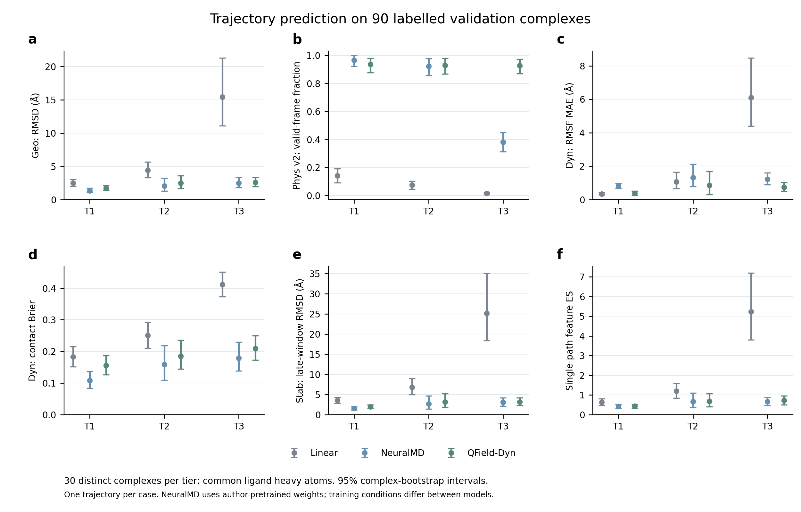

# QField-Dyn：量子化学监督响应场驱动的可泛化蛋白–配体动力学预测方法

**QField-Dyn: Generalizable Protein–Ligand Dynamics Prediction Driven by Quantum-Chemistry-Supervised Response Fields**

QField-Dyn在固定蛋白与离子环境中，根据观测轨迹、分子拓扑和物理时间生成配体未来全原子坐标。共享结构编码器、六比特量子历史状态、三层结构条件化重上传读出、条件轨迹流与几何适配器组成完整推理链。

本仓库发布2026年GOAI决赛方案，版本标签为 **`goai-finals-2026`**。随附权重对应90个非训练复合物的已报告结果：主模型第三轮、几何适配器第二轮。量子模块采用经典计算机上的密度矩阵模拟。

## 任务

| 档位 | 观测帧 | 预测帧 | 帧间隔 | 评价范围 |
|---|---:|---:|---:|---|
| T1 | 10 | 10 | 80 ps | 短期轨迹预测 |
| T2 | 80 | 20 | 80 ps | 充分观测后的预测 |
| T3 | 20 | 80 | 80 ps | 有限观测后的较长预测 |
| T4 | 10 | 490 | 1 ns | 长时程生成压力测试与运动展示 |

T4的长期未来准确性需要匹配真值验证。输出XTC包含输入体系的全部原子，蛋白和离子固定在最后观测参考结构，配体坐标随时间变化。

## 安装

Linux、Python 3.10、CUDA环境；实际验证设备为NVIDIA A800。依赖版本记录在`requirements-lock.txt`。

提交包解压后进入`GOAI_repro_xxxxxm429/`，从创建Python环境开始执行以下安装步骤。通过Git获取源码时，先执行前三行。

```bash
git clone https://github.com/my-9917/QField-Dyn.git
cd QField-Dyn
git checkout goai-finals-2026
python3.10 -m venv .venv
source .venv/bin/activate
pip install -r requirements.txt
```

`models/E3.pt`和`models/epoch_02.pt`随仓库提供。输入采用PDB、观测XTC和任务元数据，格式见[输入与推理](docs/inference.md)。预测读取观测段；未来真值只进入评价。

## 方法

模型根据观测结构与轨迹构建共享结构表示，将历史信息写入六比特量子状态，通过三层结构条件化重上传线路读出，再由条件轨迹流生成未来配体坐标。几何适配器与共价求解处理分子内部结构；蛋白和离子保持在观测参考结构。T4按区块生成，并将实际写出的坐标反馈至后续区块。

训练目标、模块接口与Geo/Phys/Dyn/Stab定义分别见[训练设置](docs/training.md)、[模型结构](docs/architecture.md)和[评价定义](docs/evaluation.md)。

## 运行

安装完成后，可显式指定输入目录和预测输出目录：

```bash
CUDA_VISIBLE_DEVICES=0 bash run.sh /path/to/GOAI_eval_public /path/to/GOAI_pred_xxxxxm429
```

入口自动准备运行模块、加载随包权重并按赛事目录格式导出XTC。默认执行一次生成并导出轨迹；额外重放与评价独立执行。`PYTHON`环境变量可指定已有的Python解释器，默认使用项目的`.venv/bin/python`。

## 复现说明

将组委会输入目录`GOAI_eval_public/`放入`GOAI_repro_xxxxxm429/`，其中包含`protocol.json`及各档输入文件；随后在复现目录执行：

```bash
CUDA_VISIBLE_DEVICES=0 bash run.sh
```

该入口覆盖T1/T2/T3各30例与T4五例。结果写入相邻的`GOAI_pred_xxxxxm429/T1`至`T4`，文件名为`<case>_pred.xtc`；中间产物保存在`outputs/reproduction/`。`reproduction_manifest.json`记录逐例导出文件，`additional_validation_performed=false`表示导出阶段只复制生成文件。生成配置、模型身份及已有检查记录随中间产物保存。公开95例用于赛事交付；报告中的90个有真值验证案例及名单单独保存在`results/truth90/`。

## Web界面

启动上传、推理、播放和下载页面：

```bash
CUDA_VISIBLE_DEVICES=0 python app/server.py --config configs/portal.example.json --port 8787
```

在服务器本机访问`http://127.0.0.1:8787/`，或使用SSH端口转发。[前端部署说明](app/README.md)

## 实验结果

MISATO验证划分中90个不同复合物，T1–T3各30例，每例一条轨迹。验证名单与双方训练名单的复合物ID交集为空。NeuralMD使用作者预训练权重，两个模型的训练条件分别披露。

| 指标 | QField-Dyn | Linear | NeuralMD |
|---|---:|---:|---:|
| 配体重原子RMSD / Å ↓ | 2.2681 | 7.4428 | 1.9719 |
| 受检合法帧比例 ↑ | 0.9314 | 0.0761 | 0.7569 |
| RMSF MAE / Å ↓ | 0.6512 | 2.4996 | 1.1161 |
| 接触Brier ↓ | 0.1838 | 0.2821 | 0.1484 |
| 后段RMSD / Å ↓ | 2.7810 | 11.8165 | 2.4621 |

QField-Dyn的运动幅度误差与受检几何结果优于此次NeuralMD迁移对照，位置与接触误差较大。30/90例包含至少一个受检几何异常帧。对比结论按指标分别解释。



[完整结果](results/truth90/完整结果与交付.md) · [分档结果](results/truth90/results.md) · [评价定义](docs/evaluation.md) · [训练设置](docs/training.md)

[决赛研究报告（PDF）](docs/finals_report.pdf)

## 代码结构

| 目录 | 内容 |
|---|---|
| `src/data/` | 原子身份、拓扑、坐标对齐及输入 |
| `src/model/` | 结构编码、量子历史、重上传、轨迹流和适配器 |
| `src/training/` | CFM、rollout损失、梯度累积和检查点 |
| `src/geometry/` | 键长、键角、手性、共价重建与局部求解 |
| `src/inference/` | 精度控制、T4反馈和XTC写出 |
| `src/evaluation/` | Geo、Phys、Dyn、Stab和概率评分 |
| `scripts/` | 数据准备、训练、评价、绘图和基线入口 |
| `tests/` | 数值、梯度与结构一致性检查 |
| `app/` | 上传输入和调用模型的Web界面 |
| `configs/`, `models/` | 配置、训练标定与实测权重 |
| `results/` | 汇总表、逐案例指标与训练记录 |

源码按功能维护；`tools/build_runtime.py`复制为既有的平面导入布局，保留数值实现。[模型结构](docs/architecture.md)

## 数据与许可

代码沿用Apache-2.0许可证。MISATO原始轨迹、比赛输入及NeuralMD作者权重由各自来源获取，使用时遵守相应条款。仓库提供评价名单、派生统计和本模型权重。[第三方与数据说明](THIRD_PARTY_NOTICES.md)
