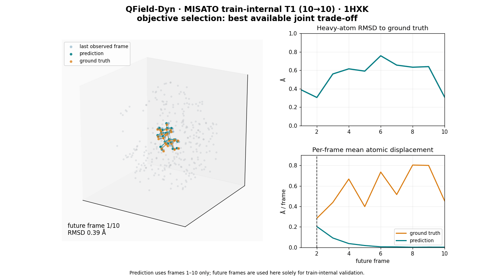
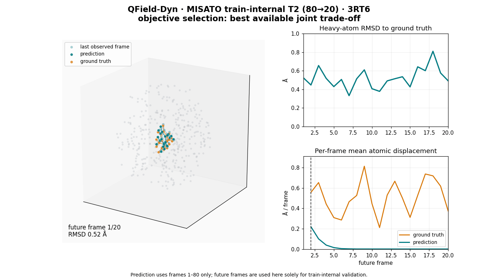
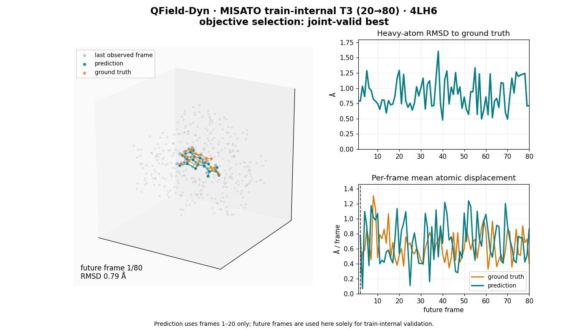
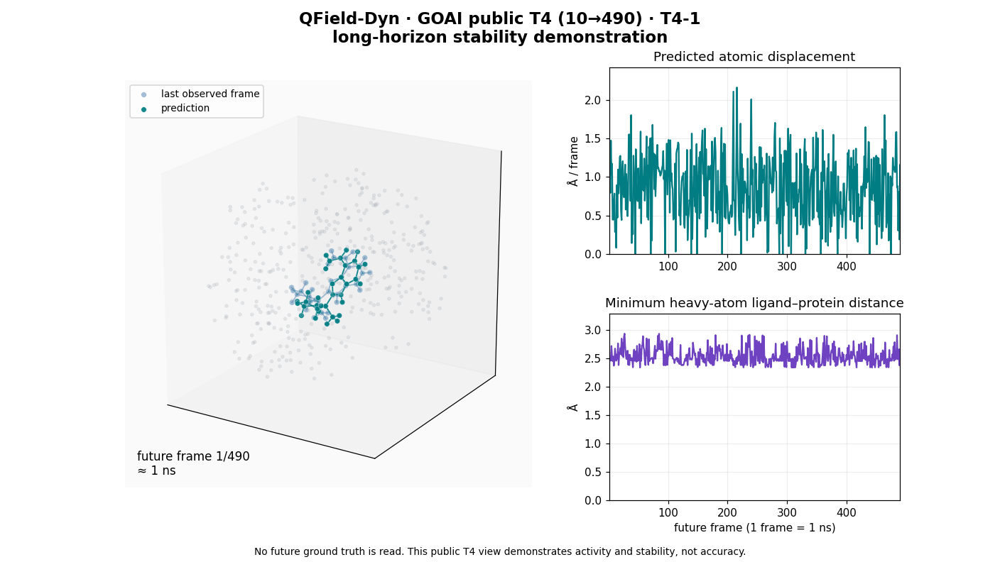

# QField-Dyn 动力学可视化

本目录展示四个时间尺度的代表性轨迹案例。T1–T3 为训练内部留出案例，用于直观比较预测运动与参考轨迹；总体结论以仓库 `results/` 中的聚合结果为准。T4 来自公开评测输入，展示长程生成的活动性与物理稳定性，公开数据不含其未来真值。

| 档次 | 文件 | 含义 |
|---|---|---|
| T1 | `t1_short_horizon.gif` | 10帧观测后预测10帧的局部运动 |
| T2 | `t2_history_conditioned.gif` | 80帧观测后预测20帧的历史条件运动 |
| T3 | `t3_representative_4lh6.gif` | 20帧观测后预测80帧的代表性联合通过案例 |
| T4 | `t4_long_horizon_stability.gif` | 10帧观测后生成490帧的长程稳定性展示 |

## T1

## T2

## T3

## T4

