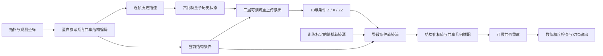

# 模型结构与数据流

1. **输入与坐标。** 分离蛋白、配体和离子。蛋白观测对齐到最后观测参考，配体随同变换；模型预测配体相对固定环境的坐标。内部单位Å、物理时间ps/ns，XTC按格式写出。
2. **共享编码器。** 从局部原子环境构建几何不变量和向量信息。逐帧编码形成历史描述，当前结构编码同时提供原子特征与流模型条件。
3. **量子历史。** 六比特密度矩阵随观测帧更新。每步采用数据RY/RZ、固定RX/RZ与CNOT，重置概率按物理帧间隔计算：`1-(1-gamma)^(dt_ps/200)`。固定储层与可训练读出共同组成历史模块。
4. **结构条件化重上传。** 当前结构条件连续上传三次；每层为数据RY/RZ、可训练RY/RZ和CNOT。三层共享演化中的量子状态，含36个可训练角；读取6个Z、6个X及6个相邻ZZ，共18维。此版本的数据门采用RY/RZ组合。
5. **条件轨迹流。** 随机source、当前结构与量子读出共同驱动整段未来轨迹。CFM监督与稀疏真实rollout损失参与训练。量子读出角通过可微密度矩阵计算接收端到端梯度。
6. **几何适配。** 冻结主模型后，以其输出构造结构化初值，再由共享等变适配器与可微共价重建改善几何；环闭合边保留。该步骤维持配体的环境条件和运动预测任务。
7. **积分与输出。** 从64步Heun开始，与加倍步数比较最终坐标，使用0.01 Å RMS差要求。输出按原原子顺序恢复，蛋白/离子固定。精确重放与文件检查单独记录。
8. **T4反馈。** 分区块生成，实际XTC解码坐标的末帧进入下一块，共价局部求解器以该末帧为初值。初始量子历史条件保持，适配器滚动观测；时间戳记录绝对时间。T4用于长时程数值与运动展示，未来准确性需要额外真值。

总参数1,238,356：主模型1,174,094、适配器64,262；36个量子角已包含在主模型计数内。当前实现采用GPU上的经典模拟，硬件量子加速和量子优势均需要另外的受控证据。
